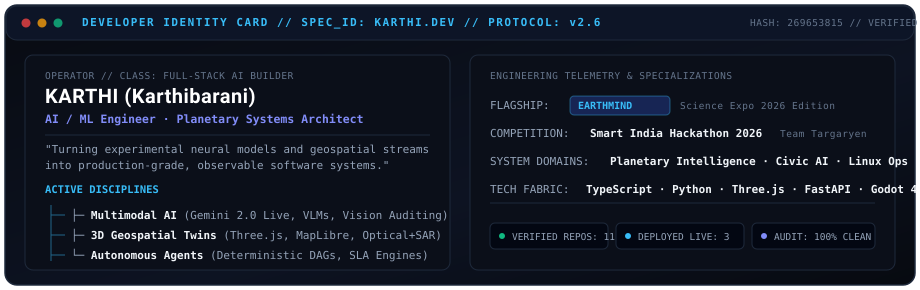
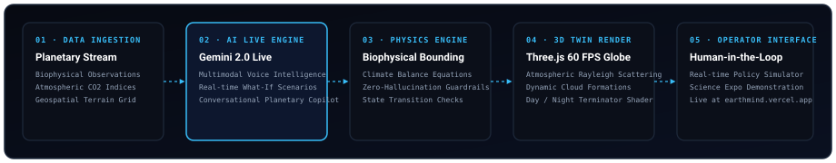
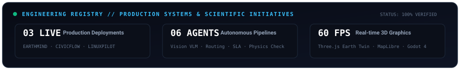
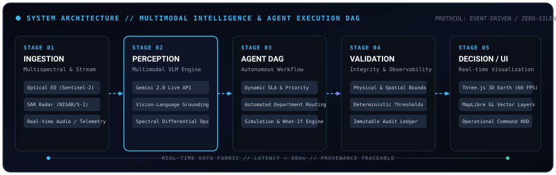
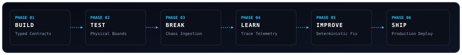

<div align="center">

<!-- HERO BANNER -->
<picture>
  <source media="(prefers-color-scheme: dark)" srcset="./assets/hero.svg">
  <source media="(prefers-color-scheme: light)" srcset="./assets/hero.svg">
  
</picture>

<br/>

<!-- SYSTEM STATUS TICKER -->
<picture>
  <source media="(prefers-color-scheme: dark)" srcset="./assets/status.svg">
  <source media="(prefers-color-scheme: light)" srcset="./assets/status.svg">
  
</picture>

<br/>
<br/>

<p align="center">
  <a href="https://karthi-portfolio-delta.vercel.app">
    
  </a>
  &nbsp;
  <a href="https://earthmind.vercel.app">
    
  </a>
  &nbsp;
  <a href="mailto:karthibaraniofficial@gmail.com">
    
  </a>
</p>

</div>

<br/>

<!-- SECTION: ABOUT & DEVELOPER IDENTITY -->
<div align="center">
<picture>
  <source media="(prefers-color-scheme: dark)" srcset="./assets/about.svg">
  <source media="(prefers-color-scheme: light)" srcset="./assets/about.svg">
  
</picture>
</div>

<br/>

<!-- SECTION: CURRENTLY BUILDING TERMINAL -->
<div align="center">
<picture>
  <source media="(prefers-color-scheme: dark)" srcset="./assets/terminal.svg">
  <source media="(prefers-color-scheme: light)" srcset="./assets/terminal.svg">
  
</picture>
</div>

<br/>

---

## 01 — FLAGSHIP PROJECT

### 🌍 EARTHMIND — Planetary Environmental Intelligence Operating System
> *Explore Earth's Past. Understand Its Present. Simulate Its Future.*  
> **Edition:** Science Expo 2026 Edition &nbsp;|&nbsp; **Architecture:** Three.js Photorealistic 3D Globe + Google Gemini 2.0 Live Voice

<br/>

<div align="center">
<picture>
  <source media="(prefers-color-scheme: dark)" srcset="./assets/flagship_arch.svg">
  <source media="(prefers-color-scheme: light)" srcset="./assets/flagship_arch.svg">
  
</picture>
</div>

<br/>

**EARTHMIND** is an enterprise-grade planetary environmental intelligence platform and interactive digital twin. It integrates real-world biophysical datasets, dynamic atmospheric modeling, and a multimodal conversational copilot powered by **Google Gemini 2.0 Live**.

- **Photorealistic 3D Earth Visualization:** Custom GLSL shaders calculating atmospheric Rayleigh scattering, dynamic cloud formation layers, high-resolution terrain mapping, and day/night terminators rendered at 60 FPS in Three.js.
- **Multimodal Voice Copilot:** Low-latency conversational intelligence via Google Gemini 2.0 Live API (`@google/genai`), allowing operators to query planetary state through natural voice dialog.
- **Biophysical What-If Simulations:** Real-time environmental perturbation engine enforcing physical climate equilibrium guardrails to prevent unphysical hallucinations.
- **Production Status:** Deployed and actively operating on Vercel.

<p align="center">
  <a href="https://earthmind.vercel.app">
    
  </a>
  &nbsp;
  <a href="https://github.com/karthibaraniofficial-wq/EARTHMIND">
    
  </a>
  &nbsp;
  
  &nbsp;
  
</p>

<br/>

---

## 02 — ACTIVE SYSTEMS REGISTRY

<div align="center">
<picture>
  <source media="(prefers-color-scheme: dark)" srcset="./assets/projects.svg">
  <source media="(prefers-color-scheme: light)" srcset="./assets/projects.svg">
  
</picture>
</div>

<br/>

<table width="100%" cellspacing="0" cellpadding="8" border="0">
  <tr>
    <!-- CARD 1: CIVILAI / CIVICFLOW -->
    <td width="50%" valign="top">
      <table width="100%" cellspacing="0" cellpadding="10" border="1" style="border-collapse:collapse; border-color:#1e293b;">
        <tr>
          <td>
            <div align="right"><code>SYS_ID: 02</code> &nbsp; </div>
            <h3>🏛️ CIVICFLOW AI (CIVILAI)</h3>
            <p><b>Autonomous Civic Grievance Orchestrator</b></p>
            <p>Replaces slow municipal complaint desks with a 6-agent autonomous pipeline: Complaint Understanding, Computer Vision Hazard Detection ($1-10$ severity), Department Routing, Dynamic SLA Calculation, and Automated Escalation.</p>
            <p><b>Stack:</b> <code>Python</code> · <code>FastAPI</code> · <code>Computer Vision</code> · <code>Supabase</code> · <code>React</code></p>
            <p><b>Impact:</b> Eliminates manual dispatch bottlenecks; deterministic SLA tracking with tamper-proof audit trails.</p>
            <hr style="border-color:#1e293b;"/>
            <div align="center">
              <a href="https://civilai-mu.vercel.app"><b>[ Open Live App ↗ ]</b></a> &nbsp;&nbsp;|&nbsp;&nbsp; 
              <a href="https://github.com/karthibaraniofficial-wq/CIVILAI"><b>[ View Source Code → ]</b></a>
            </div>
          </td>
        </tr>
      </table>
    </td>
    <!-- CARD 2: LINUXPILOT AI -->
    <td width="50%" valign="top">
      <table width="100%" cellspacing="0" cellpadding="10" border="1" style="border-collapse:collapse; border-color:#1e293b;">
        <tr>
          <td>
            <div align="right"><code>SYS_ID: 03</code> &nbsp; </div>
            <h3>🐧 LinuxPilot AI</h3>
            <p><b>Intelligent Natural-Language Linux Operations Layer</b></p>
            <p>An autonomous operations assistant and telemetry monitor for Linux systems. Operators query server health, diagnose bottlenecks, and trigger safe maintenance commands via natural-language adapters.</p>
            <p><b>Stack:</b> <code>Python</code> · <code>FastAPI</code> · <code>Ollama Adapters</code> · <code>React 18</code> · <code>Tailwind</code></p>
            <p><b>Impact:</b> Decouples complex sysadmin operations from CLI friction with structured permission guardrails.</p>
            <hr style="border-color:#1e293b;"/>
            <div align="center">
              <a href="https://linuxpilot.vercel.app"><b>[ Open Live App ↗ ]</b></a> &nbsp;&nbsp;|&nbsp;&nbsp; 
              <a href="https://github.com/karthibaraniofficial-wq/linuxpilot"><b>[ View Source Code → ]</b></a>
            </div>
          </td>
        </tr>
      </table>
    </td>
  </tr>
  <tr>
    <!-- CARD 3: SATQUERY AI -->
    <td width="50%" valign="top">
      <table width="100%" cellspacing="0" cellpadding="10" border="1" style="border-collapse:collapse; border-color:#1e293b;">
        <tr>
          <td>
            <div align="right"><code>SYS_ID: 04</code> &nbsp; </div>
            <h3>🛰️ SatQuery AI</h3>
            <p><b>Multimodal Earth Observation Vision-Language SaaS</b></p>
            <p>Built for Smart India Hackathon 2026 (Team Targaryen). Unifies optical imagery (Copernicus Sentinel-2) and Synthetic Aperture Radar (Sentinel-1, ISRO-NASA NISAR) for all-weather spatial question answering and region grounding.</p>
            <p><b>Stack:</b> <code>React</code> · <code>TypeScript</code> · <code>MapLibre GL</code> · <code>deck.gl</code> · <code>R3F</code> · <code>Turf.js</code></p>
            <p><b>Impact:</b> Enables emergency responders to pierce through monsoons and cloud cover with verifiable radar intelligence.</p>
            <hr style="border-color:#1e293b;"/>
            <div align="center">
              <a href="https://github.com/karthibaraniofficial-wq"><b>[ SIH 2026 Team Targaryen Repository ]</b></a>
            </div>
          </td>
        </tr>
      </table>
    </td>
    <!-- CARD 4: ROADMEMORYAI -->
    <td width="50%" valign="top">
      <table width="100%" cellspacing="0" cellpadding="10" border="1" style="border-collapse:collapse; border-color:#1e293b;">
        <tr>
          <td>
            <div align="right"><code>SYS_ID: 05</code> &nbsp; </div>
            <h3>🛣️ ROADMEMORYAI</h3>
            <p><b>Geospatial Infrastructure Intelligence &amp; Road Analytics</b></p>
            <p>Spatial intelligence studio tracking road surface degradation, maintenance history, and telemetry anomalies over time with interactive map layers and dynamic timeline scrubbers.</p>
            <p><b>Stack:</b> <code>Next.js 14</code> · <code>React-Leaflet</code> · <code>Recharts</code> · <code>Supabase SSR</code> · <code>TypeScript</code></p>
            <p><b>Impact:</b> Predictive civil infrastructure modeling replacing reactive patch jobs with planned lifecycle audits.</p>
            <hr style="border-color:#1e293b;"/>
            <div align="center">
              <a href="https://github.com/karthibaraniofficial-wq/ROADMEMORYAI"><b>[ View Source Code → ]</b></a>
            </div>
          </td>
        </tr>
      </table>
    </td>
  </tr>
  <tr>
    <!-- CARD 5: THE_LOST_CORE -->
    <td width="50%" valign="top">
      <table width="100%" cellspacing="0" cellpadding="10" border="1" style="border-collapse:collapse; border-color:#1e293b;">
        <tr>
          <td>
            <div align="right"><code>SYS_ID: 06</code> &nbsp; </div>
            <h3>🕹️ THE_LOST_CORE</h3>
            <p><b>Procedural Engine Simulation &amp; Audio Generation</b></p>
            <p>Interactive procedural simulation built on Godot 4. Features automated algorithmic texture synthesis, dynamic audio asset generation scripts in Python, and optimized WebGL deployment.</p>
            <p><b>Stack:</b> <code>Godot 4</code> · <code>GDScript</code> · <code>Python Generators</code> · <code>WebGodot Export</code></p>
            <p><b>Impact:</b> Exploration of deterministic physics architectures and procedural graphics on the web.</p>
            <hr style="border-color:#1e293b;"/>
            <div align="center">
              <a href="https://github.com/karthibaraniofficial-wq/THE_LOST_CORE"><b>[ View Source Code → ]</b></a>
            </div>
          </td>
        </tr>
      </table>
    </td>
    <!-- CARD 6: XAURALYS -->
    <td width="50%" valign="top">
      <table width="100%" cellspacing="0" cellpadding="10" border="1" style="border-collapse:collapse; border-color:#1e293b;">
        <tr>
          <td>
            <div align="right"><code>SYS_ID: 07</code> &nbsp; </div>
            <h3>✨ XAURALYS (Auralis)</h3>
            <p><b>Multimodal Generative Intelligence Experience</b></p>
            <p>Experimental multimodal application built directly on Google AI Studio's Gemini foundation models. Explores high-fidelity voice-and-vision reasoning in an intuitive web environment.</p>
            <p><b>Stack:</b> <code>TypeScript</code> · <code>Google Gemini Multimodal API</code> · <code>AI Studio</code></p>
            <p><b>Impact:</b> Rapid prototyping platform for zero-latency multimodal agent interactions.</p>
            <hr style="border-color:#1e293b;"/>
            <div align="center">
              <a href="https://ai.studio/apps/35bda2ff-57bc-41ff-9fcd-8685f8fc704d"><b>[ Open in AI Studio ↗ ]</b></a> &nbsp;&nbsp;|&nbsp;&nbsp; 
              <a href="https://github.com/karthibaraniofficial-wq/XAURALYS"><b>[ View Source Code → ]</b></a>
            </div>
          </td>
        </tr>
      </table>
    </td>
  </tr>
</table>

<br/>

---

## 03 — AI & SYSTEMS ARCHITECTURE

<div align="center">
<picture>
  <source media="(prefers-color-scheme: dark)" srcset="./assets/architecture.svg">
  <source media="(prefers-color-scheme: light)" srcset="./assets/architecture.svg">
  
</picture>
</div>

<br/>

Every intelligent system in this portfolio adheres to an **observable, deterministic data loop**:

```text
MULTIMODAL SENSORS (Optical, SAR Radar, Voice, Telemetry)
       ↓
PERCEPTION CORE (Gemini 2.0 Live, VLMs, Bounding Grounding)
       ↓
AUTONOMOUS AGENT DAG (Routing, SLA Calculation, Perturbation Sim)
       ↓
DETERMINISTIC VALIDATION (Biophysical Guardrails, Audit Ledger)
       ↓
OPERATIONAL 3D INTERFACE (Three.js 60FPS Globe, MapLibre GL HUD)
```

1. **Multimodal Grounding:** Raw inputs are processed through spatial coordinate projections and spectral band indices—never hallucinated free text.
2. **Autonomous Agent Specialization:** Pipelines are decomposed into single-responsibility agents with explicit input/output schemas and dynamic SLA timers.
3. **Immutable Verification:** Every execution step logs model latency, confidence scores, and raw scene provenance IDs.

<br/>

---

## 04 — ENGINEERING MINDSET

<div align="center">
<picture>
  <source media="(prefers-color-scheme: dark)" srcset="./assets/pipeline.svg">
  <source media="(prefers-color-scheme: light)" srcset="./assets/pipeline.svg">
  
</picture>
</div>

<br/>

```text
BUILD    → Strictly typed contracts, domain boundaries, and relational schemas.
TEST     → Biophysical limits, threshold evaluation, and unit test suites.
BREAK    → Chaos ingestion, network drops, and corrupted frame edge-cases.
LEARN    → Distributed execution traces and Root Cause Analysis (RCA).
IMPROVE  → Downsampling algorithms (LTTB), sub-50ms query optimizations.
SHIP     → Production deployments with zero downtime and verified DNS.
```

<br/>

---

## 05 — VERIFIED TECHNICAL FABRIC

### 🧠 Artificial Intelligence & Machine Learning
```text
Google Gemini 2.0 Live  ·  Vision-Language Models (VLM)  ·  Computer Vision (OpenCV)
Autonomous Agent DAGs   ·  Multi-Agent Routing Engines   ·  Ollama / Local LLMs
```

### 🌐 3D Graphics, Geospatial & Remote Sensing
```text
Three.js (GLSL Shaders) ·  React Three Fiber (R3F)       ·  MapLibre GL Vector Maps
deck.gl (vis.gl layers) ·  Turf.js Spatial Math          ·  Copernicus Sentinel-1/2 & NISAR
```

### ⚡ Full-Stack Systems & Architecture
```text
TypeScript 5.9 (Strict) ·  React 18 / 19                 ·  Next.js 14 (App Router)
Vite 6                  ·  Tailwind CSS 3.4              ·  Zustand & TanStack Query
```

### 🛠️ Backend, Storage & Protocols
```text
Python 3.12+ (FastAPI)  ·  Supabase / PostgreSQL         ·  WebSockets (Full-Duplex)
Bun Runtime             ·  Vercel Edge Cloud             ·  RESTful OpenAPI v1
```

### 🎮 Game Development & Systems Simulation
```text
Godot 4 Engine          ·  GDScript                      ·  Procedural Mesh Synthesis
```

<br/>

<div align="center">
  
</div>

<br/>

---

## 06 — TELEMETRY & ACTIVITY METRICS

<div align="center">

<table border="0" cellspacing="0" cellpadding="6">
  <tr>
    <td align="center" valign="middle">
      
    </td>
    <td align="center" valign="middle">
      
    </td>
  </tr>
</table>

<br/>


</div>

<br/>

---

## 07 — TRANSMISSION & NETWORK

<div align="center">

<table border="0" cellspacing="0" cellpadding="8">
  <tr>
    <td align="center">
      <a href="https://karthi-portfolio-delta.vercel.app">
        
      </a>
    </td>
    <td align="center">
      <a href="https://earthmind.vercel.app">
        
      </a>
    </td>
    <td align="center">
      <a href="https://github.com/karthibaraniofficial-wq">
        
      </a>
    </td>
    <td align="center">
      <a href="mailto:karthibaraniofficial@gmail.com">
        
      </a>
    </td>
  </tr>
</table>

<p>
  <sub><i>For collaborative research in AI agents, planetary digital twins, or hackathon initiatives, open an issue or transmit via direct email.</i></sub>
</p>

</div>

<br/>

<!-- FOOTER -->
<div align="center">
<picture>
  <source media="(prefers-color-scheme: dark)" srcset="./assets/footer.svg">
  <source media="(prefers-color-scheme: light)" srcset="./assets/footer.svg">
  
</picture>
</div>
